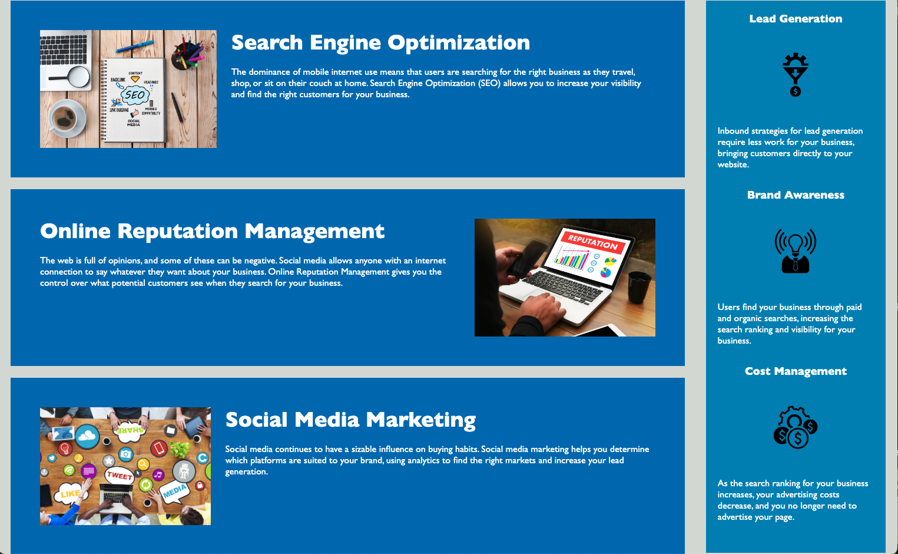

# Code Refactor Starter Code Module 1 Project #

## Description
This project is my first graded assignment for Module 1.  This project involved using learnings from HTML, CSS, and Github/terminal to update the project for an imaginary client.  My goal with this project is to better understand how the learning from our first weeks of class can be applied in the real world.  While working on this project did help me, a majority of the improvement will come from the feedback that I receive, as I did not feel secure on this one.  I did better solidify my understanding of which commands to use when, accessibility changes for semantic HTML, and how the style sheet interacts with the HTML file.

## Installation
Visit github repository at https://github.com/jeremiahthegreat1/Module-1-Challenge/tree/main and clone the repo to your own new repository.  

## Usage
Visit https://jeremiahthegreat1.github.io/Module-1-Challenge/#social-media-marketing. There is a navigation area in the top right that allows you to select links that bring you further down the page, to the applicable content you selected. 

## Credits
Source/Starter code from Xandromus (Xander Rapstine).  Profile can be found at https://github.com/Xandromus.

## License
MIT License

Copyright (c) 2023 jeremiahthegreat1

Permission is hereby granted, free of charge, to any person obtaining a copy
of this software and associated documentation files (the "Software"), to deal
in the Software without restriction, including without limitation the rights
to use, copy, modify, merge, publish, distribute, sublicense, and/or sell
copies of the Software, and to permit persons to whom the Software is
furnished to do so, subject to the following conditions:

The above copyright notice and this permission notice shall be included in all
copies or substantial portions of the Software.

THE SOFTWARE IS PROVIDED "AS IS", WITHOUT WARRANTY OF ANY KIND, EXPRESS OR
IMPLIED, INCLUDING BUT NOT LIMITED TO THE WARRANTIES OF MERCHANTABILITY,
FITNESS FOR A PARTICULAR PURPOSE AND NONINFRINGEMENT. IN NO EVENT SHALL THE
AUTHORS OR COPYRIGHT HOLDERS BE LIABLE FOR ANY CLAIM, DAMAGES OR OTHER
LIABILITY, WHETHER IN AN ACTION OF CONTRACT, TORT OR OTHERWISE, ARISING FROM,
OUT OF OR IN CONNECTION WITH THE SOFTWARE OR THE USE OR OTHER DEALINGS IN THE
SOFTWARE.